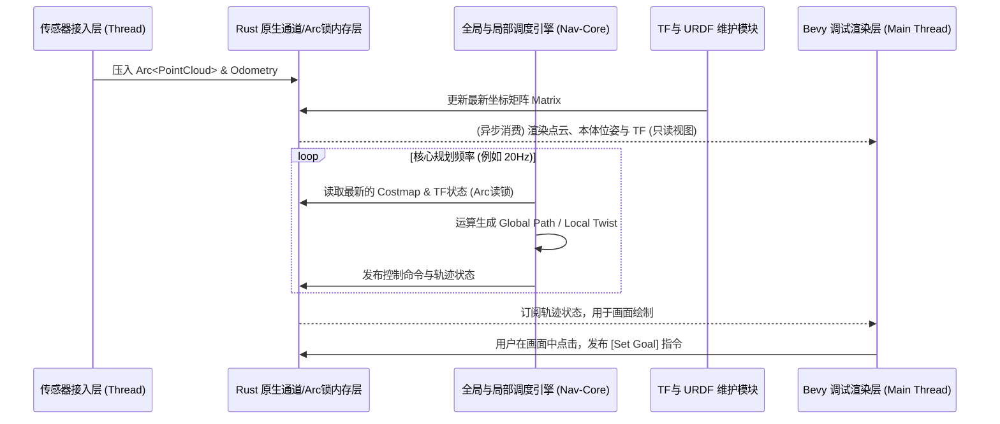

# 产品路线图与架构设计蓝图 (NavRS)

## 1. 核心目标 (Mission)
打造一个内存安全、确定性且纯 Rust 实现的单进程、零拷贝机器人导航系统（NavRS）。核心导航调度与 Bevy 可视化渲染完全解耦，提供极简的性能表现与最直观的白盒调试体验，彻底告别传统 ROS2/DDS 架构下由于线程间通信不稳定、指针飞线导致的黑箱痛点。

## 2. 用户画像 (Persona)
- **目标用户**：机器人研发工程师、算法研究员、自动驾驶开发者。
- **核心痛点**：传统 Nav2 调试成本极高（难以可视化内部变量）、跨进程/节点通信不可靠、内存泄漏与 C++ 段错误频繁，且业务逻辑与执行框架（ROS2 nodes）深度耦合。

## 3. 产品版本规划

### V1: 最小可行产品 (MVP)
*目标：走通单机闭环，能够在已知地图上避障并到达目标点，核心引擎与 GUI 严格解耦。*
- **纯 Rust 零拷贝数据总线**：基于 `crossbeam_channel` 和 `Arc<RwLock>` 实现进程内多线程通信与大内存（Costmap, PointCloud）共享。
- **纯粹的核心业务层**：独立于 Bevy 等所有外部框架，所有核心模块（全局规划器、局部控制器）先使用具体的 Rust Trait 实现硬编码解耦，为未来插件化铺路。
- **独立 TF 系统 (无界依赖)**：支持解析 `URDF`文件，类似 TF2 的树状拓扑，通过独立线程维护全局坐标系变换树。
- **核心导航栈 (硬核解耦版)**：实现基础基础的 2D Costmap、A*/Dijkstra 全局规划、简单运动学局部控制。
- **Bevy 诊断与渲染层 (解耦的前端)**：订阅核心引擎的数据进行 2.5D 实时渲染，用于显示点云、代价地图、轨迹以及 TF 数据监控面板。

### V2 及以后版本 (Future Releases)
- **动态加载插件系统**：支持通过动态链接库 (dylib) 或 WebAssembly 热插拔第三方自定义规划器、控制器。
- **3D 真实现境仿真环境**：Bevy 脱离单纯的 Debug GUI 角色，兼任 3D 物理引擎，提供雷达光线追踪发迹与物理碰撞反馈。
- **高级重定位机制**：AMCL 或 基于 3D LiDAR 的真实 SLAM 系统整合。
- **自定义轻量级网桥**：如需扩展分布式，提供类似 TCP/QUIC 的零时延扩展桥接，而非妥协于传统 DDS。

## 4. 关键业务逻辑 & 数据契约
- **业务规则 1 - 绝对解耦**：核心算法不能引入任何 `bevy_ecs` 或前端图形学依赖；Bevy 只能以“只读消费者（监听器）”或“控制指令下发者”的身份与导航核心交互。
- **业务规则 2 - 零拷贝**：对于极其沉重的数据载体（`PointCloud`, `Costmap Grid`），在输入侧即刻被封装为 `Arc` 智能指针，贯穿始终，避免在管道传输中产生深拷贝消耗。
- **数据契约 (MVP)**：
  - 输入：`Odometry` (位姿+Twist), `LaserScan`/`PointCloud` (3D点数组), `GoalPose`。
  - 核心状态：`TF Tree`, `Global Costmap` (网格阵列)。
  - 输出：`Twist` 给底盘串口或仿真物理控制器。

## 5. 架构设计蓝图

### 5.1 核心流程图 (完全解耦渲染与控制)



### 5.2 组件交互与解耦设计
- `navrs_core` (crate): 纯业务模块。定义 Trait (`GlobalPlanner`, `LocalController`)，使用 `crossbeam` 或 `tokio_sync`。
- `navrs_tf` (crate): 纯数学模块。读取解析URDF生成固定树，提供基于时间的插值查询 `lookup_transform(target, source, time)`。
- `navrs_bevy_ui` (crate): 此模块只做一件事，即启动 Bevy App，接收 `navrs_core` 抛出的 `Arc<Map>` 并将其转换为 `SpriteBundle` 渲染；绘制轨迹线以及接收用户鼠标操作。

### 5.3 技术选型与风险
- **核心数据通道**：`crossbeam_channel` (适用于密集计算的事件传递) 或 `tokio::sync::watch` (用于状态广播，如当前底盘最新坐标)。
- **GUI 与主线程锁死风险**：由于操作系统的图形化要求，Bevy 必须运行在**主线程**。因此，导航核心系统 (`navrs_core`) 必须启动自己独立的线程池(如 `std::thread` 或 `rayon`) 在后台静默运行并与主线程 Bevy App 交换信息。

## 6. MVP 原型设计 (硬核开发双屏/分屏布局)

由于我们的核心痛点在于“黑箱”和“无法观测底层状态”，MVP采用**监控终端+视图**拆分的白盒界面策略，Bevy 的画布用来完全映射内核数据：

```text
+---------------------------------+---------------------------+
| 2.5D VIEW BEVY CANVAS           | MATRIX & DEBUG TERMINAL   |
|                                 |                           |
|             ^ Goal              | [Costmap Value at Rob]    |
|           /   \                 | Obstacle dist: 1.25m      |
|          /      \               | Cell value: 12             |
|       . ' .       \             |                           |
|       [Rob] ------- * Path      | [TF Current Vectors]      |
|       /   \         /           | odom_2_base:              |
|      /      \      /            | [ 0.9, -0.1, 0.0]         |
|     .        .    /             | [ 0.1,  0.9, 0.0]         |
|                                 |                           |
|                                 | [Latency Profiler]        |
|                                 | Core_Planner: 12ms        |
+---------------------------------+ Core_Controller: 2ms      |
| [Toolbox] 2D Nav Goal | Reset   | Zero-Copy Arc count: 4    |
+---------------------------------+---------------------------+
```
